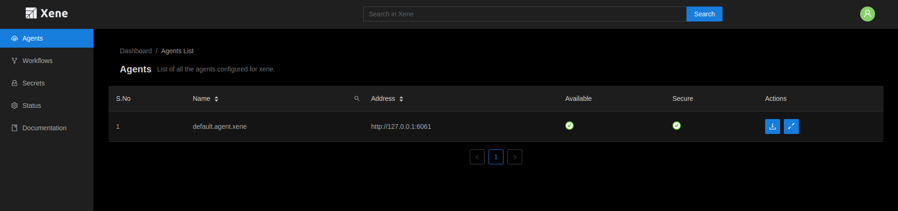
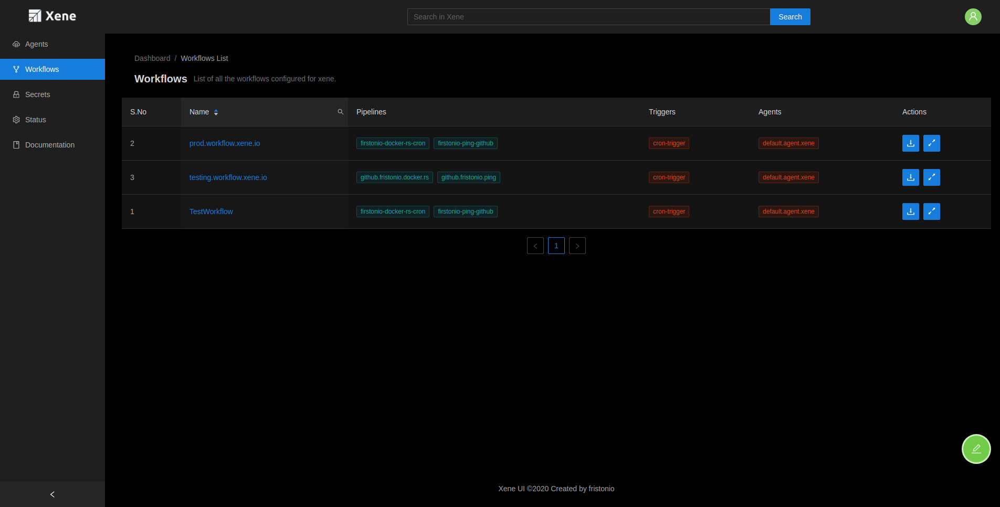
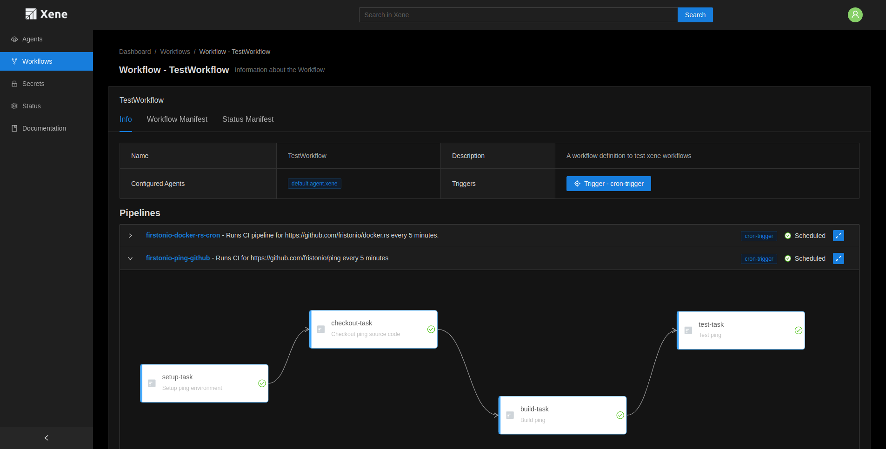
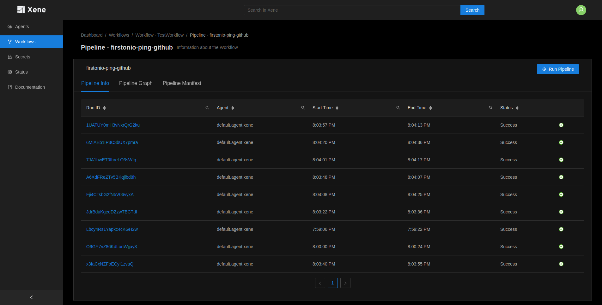
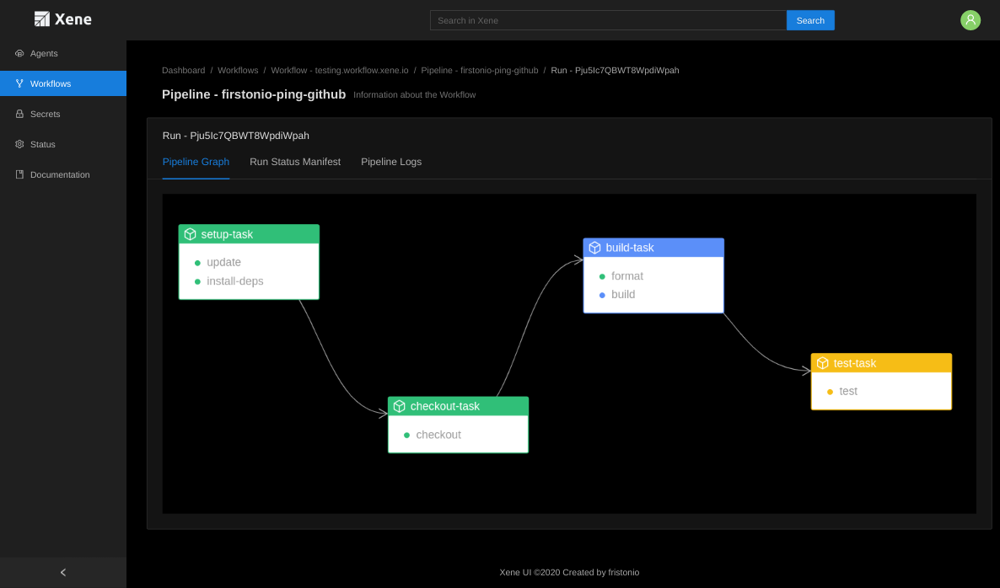

# Xene UI

> Xene UI is currently in Beta. You can make interaction with Xene using this UI.

## Installation

Follow below mentioned instruction to set up xene.

```bash
$ git clone https://github.com/fristonio/xene-ui && cd xene-ui

# To run the developement server
$ yarn start
Development server is running on http://localhost:3000/

# To build UI
$ yarn build
```

## UI Screens

### Agents List Page



### Workflow List Page



### Workflow Info Page



### Pipelines Info Page



### Pipeline Run Info Page


