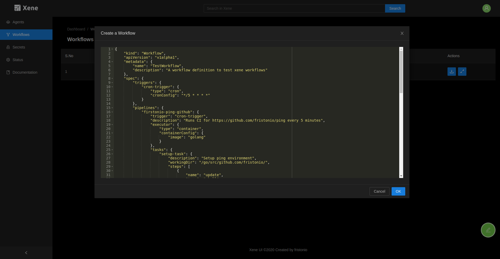

# Running Workflows

Xene provides three ways in which you can run your workflows.:

1. Locally running workflows using `xenectl`
2. Using `xenectl` and xene deployment
3. Using [xene-ui](https://github.com/fristonio/xene-ui)

## Local run

Xene gives you the capability to run the workflows locally as well. It is as simple as giving your workflow manifest to the `xenectl workflow run` command. For this execution to succeed, make sure you have the environment setup for the requested executor. For example, if you are using `docker` executor, you need to have `docker` running on your system.

To run your workflow locally, first, create a workflow manifest with all the desired specifications. To know more about the type for workflow manifest definition, go [here](https://github.com/fristonio/xene).

A sample workflow manifest:

```json
{
    "kind": "Workflow",
    "apiVersion": "v1alpha1",
    "metadata": {
        "name": "TestWorkflow",
        "description": "A workflow definition to test xene workflows"
    },
    "spec": {
        "triggers": {
            "cron-trigger": {
                "type": "cron",
                "cronConfig": "*/5 * * * *"
            }
        },
        "pipelines": {
            "firstonio-ping-github": {
                "trigger": "cron-trigger",
                "description": "Runs CI for https://github.com/fristonio/ping every 5 minutes",
                "executor": {
                    "type": "container",
                    "containerConfig": {
                        "image": "golang"
                    }
                },
                "tasks": {
                    "setup-task": {
                        "description": "Setup ping environment",
                        "workingDir": "/go/src/github.com/fristonio/",
                        "steps": [
                            {
                                "name": "update",
                                "type": "shell",
                                "cmd": "apt-get -y update"
                            },
                            {
                                "name": "install-deps",
                                "type": "shell",
                                "cmd": "apt-get -y install git curl make"
                            }
                        ]
                    },
                    "checkout-task": {
                        "description": "Checkout ping source code",
                        "workingDir": "/go/src/github.com/fristonio/",
                        "dependencies": ["setup-task"],
                        "steps": [
                            {
                                "name": "checkout",
                                "type": "shell",
                                "cmd": "git clone https://github.com/fristonio/ping"
                            }
                        ]
                    },
                    "build-task": {
                        "description": "Build ping",
                        "workingDir": "/go/src/github.com/fristonio/ping/",
                        "dependencies": [
                            "checkout-task"
                        ],
                        "steps": [
                            {
                                "name": "format",
                                "type": "shell",
                                "cmd": "make format"
                            },
                            {
                                "name": "build",
                                "type": "shell",
                                "cmd": "make build"
                            }
                        ]
                    },
                    "test-task": {
                        "description": "Test ping",
                        "workingDir": "/go/src/github.com/fristonio/ping/",
                        "dependencies": [
                            "build-task"
                        ],
                        "steps": [
                            {
                                "name": "test",
                                "type": "shell",
                                "cmd": "ls -la ping"
                            }
                        ]
                    }
                }
            }
        }
    }
}
```

**NOTE:** Xene currently only supports JSON for writing workflow manifest. Work on YAML based manifest is underway.

In the above sample manifest, we create a Workflow named `TestWorkflow` with a single trigger(cron-trigger) and a single pipeline(fristonio-ping-github). The pipeline contains four tasks with each having at least one CMD step.

Create a new file with the above workflow manifest(workflow.json) and simply run the workflow using `xenectl`.

```bash
$ xenectl workflow run -f workflow.json --local
```


All the log files are store relative to the xene agent logs directory(default: /var/run/xene/agent/logs/).

## Distributed Xene Setup with xenectl

This is is the most common use case when using xene for running workflow. For this you need to have Xene up and running.
Configure your `xenectl` configuration so that it can access the APIServer.

To run the workflow, create a workflow manifest and run the following command

```bash
$ xenectl workflow create -f workflow.json
INFO[0000] TestWorkflow workflow created/updated
```

At this point the workflow has been created and xene will soon start a controller to watch for the state of this object.
You can see the status of the workflow using the below command.

To run the workflow, create a workflow manifest and run the following command

```bash
$ xenectl workflowstatus get --name TestWorkflow

{
  "apiVersion": "v1alpha1",
  "kind": "WorkflowStatus",
  "metadata": {
    "name": "TestWorkflow"
  },
  "pipelines": {
    "firstonio-ping-github": {
      "executor": "default.agent.xene",
      "previousExecutors": [],
      "status": "Scheduled"
    }
  },
  "workflowSpec": "SPEC"
}
```

## Distributed Xene Setup with UI

You can also use the UI to manage the cluster, in this case you can also create workflow manifest. For this first make sure
that your xene setup is up and running. Run the UI server and check if the UI is able to connect to the cluster. Login using
Google OAuth configured for Xene and go to [workflow list page](http://localhost:3000/dashboard/workflows)

Click on the Edit Icon at the bottom right of the webpage


Write the manifest in the provided text editor and then Click on OK.



The workflow object is created at the APIServer and one can use the UI to view the pipelines status and run informations.
